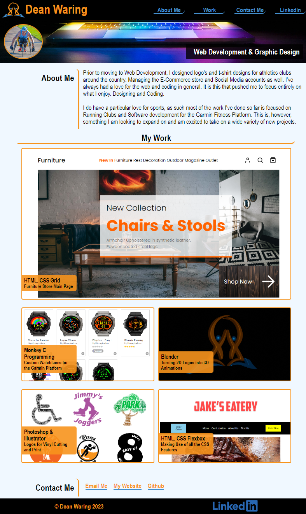

# Portfolio Site 
Personal portfolio site built with a Mobile-First approach.
Uses CSS Grid and Flexbox as well as media Queries

## User Requirements
I need a portfolio site that:
1) Showcases the projects I've built
2) Is fully mobile responsive and diplays well on all screens
3) It needs to demonstrate both Flexbox and Grid use
4) It must have links that link to both internel and external content

## Problems solved
1) The site uses flexboxes effectively
2) The site uses CSS grid that changes for screensizes
3) The site succesfully links to several projects that I have completed
4) All links working both internal and externel
5) LinkedIn Profile also included

## Hosted Site:
https://www.deanwaring.co.uk

### Project Overview
 Very challenging project. Particularly when making changes with media queries
 trying to ensure that my changes don't accidentally effect other parts of the document.  
Definitely feel I learnt a lot getting this project completed. 
### Final Result Mock Up
